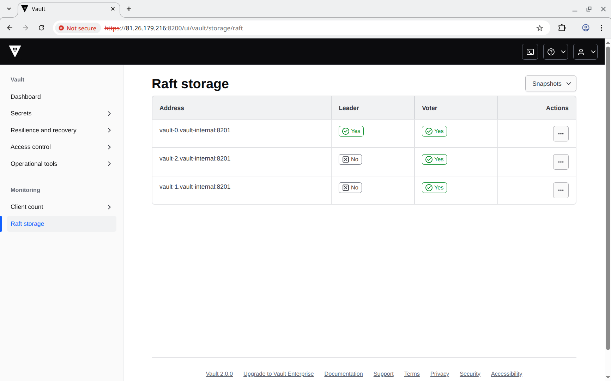
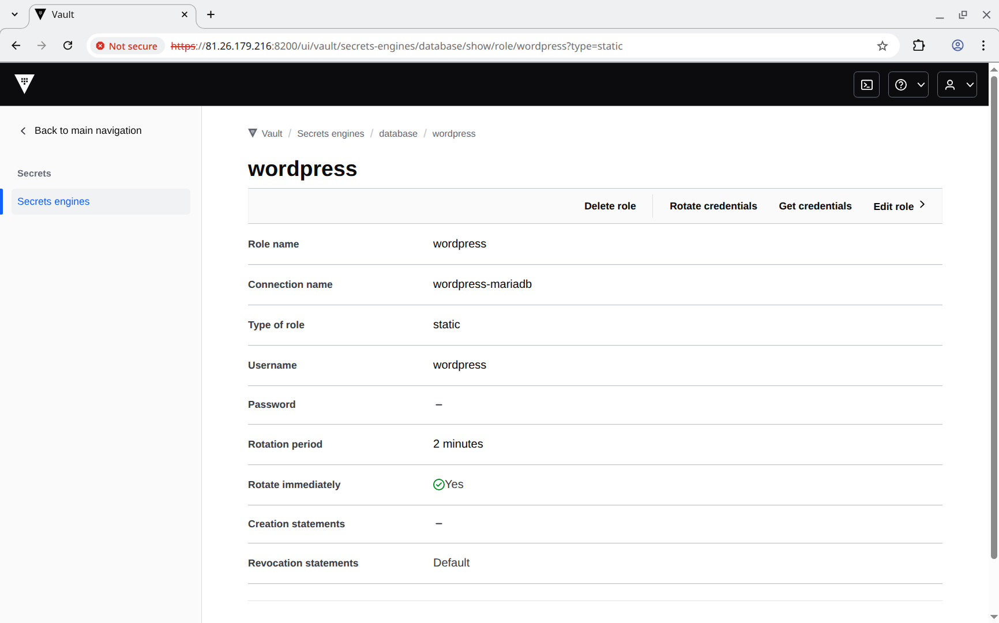
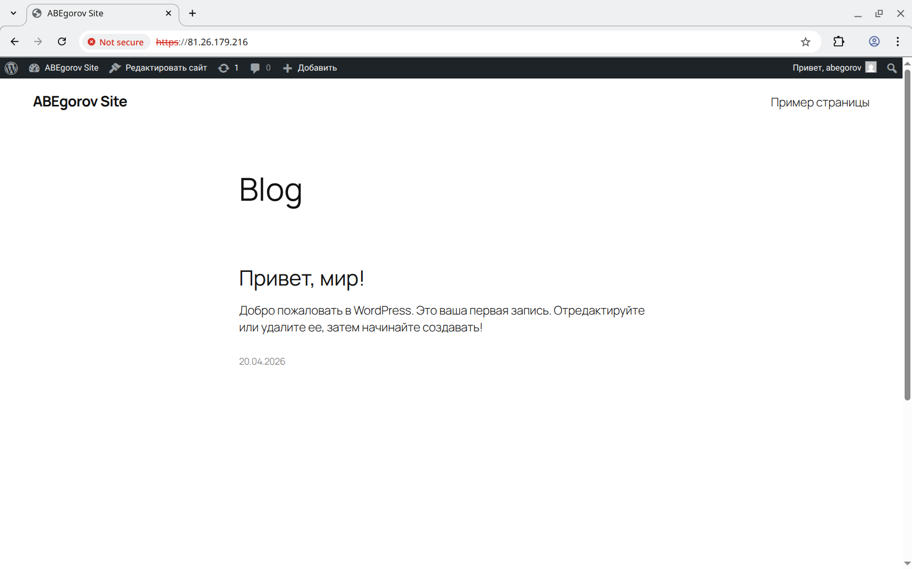

# Веб-портал с централизованным хранилищем секретов в Kubernetes

## Задание

Развернуть веб-приложение через Kubernetes. Централизовать хранение секретов с помощью **Vault** и реализовать автоматическое обновление паролей к БД.

1. Разверните кластер веб-приложения с использованием **Kubernetes**.
2. Разверните кластер **Vault**.
3. Настройте интеграцию **Vault** с базой данных и реализацию динамической выдачи паролей, которые обновляются каждые 2 минуты.
4. Обеспечьте доставку обновлённого пароля в приложение (например, через шаблоны **Consul Template**, **Vault Agent** или переменные окружения).

## Реализация

Проект базируется на предудущем проекте [linuxhl31_kubernetes](https://github.com/abegorov/linuxhl31_kubernetes). Дополнительно добавлено следующее:

1. Генерация сертификатов для **vault** и **vault agent** с помощью **cert-manager** (основные настройки указаны в [roles/vault/defaults/main.yml](roles/vault/defaults/main.yml) и [manifests/vault-client-tls-cert.yml](manifests/vault-client-tls-cert.yml)).
2. Автоматическая установка кластера **vault** из 3-х узлов (используется **raft integrated storage**) с помощью [hashicorp/vault-helm](https://github.com/hashicorp/vault-helm) и **helm-git** (основные настройки указаны в [roles/vault/defaults/main.yml](roles/vault/defaults/main.yml)).
3. Автоматическое выполнение инициализации **vault**, сохранении **unseal** токена в качестве секрета в **kubernetes** и автоматическом выполнении **unseal** в **sidecar** контейнере (основные настройки указаны в [roles/vault/defaults/main.yml](roles/vault/defaults/main.yml)).
4. В **vault** создаётся **database engine**, подключение к базе данных **wordpress-mariadb** и статическая роль **wordpress**, которая автоматически меняет пароль каждые 2 минуты (настройки указаны в [group_vars/control/vault.yml](group_vars/control/vault.yml)).
5. Создаётся политика **wordpress**, которая разрешает операции **read** и **subscribe** для `database/static-creds/wordpress` (настройки указаны в [group_vars/control/vault.yml](group_vars/control/vault.yml)).
6. Включается и настраивается **kubernetes auth engine** и настраивается роль **wordpress** для аутентификации **vault agent** из **kubernetes** (настройки указаны в [group_vars/control/vault.yml](group_vars/control/vault.yml)).
7. С помощью аннотаций в [manifests/wordpress.yml](manifests/wordpress.yml) настраивает **Vault Agent injector** для запуска **Vault Agent** в качестве **sidecar** к контейнеру **wordpress**.

```yaml
      annotations:
        vault.hashicorp.com/agent-inject: 'true'
        vault.hashicorp.com/agent-inject-status: update
        vault.hashicorp.com/agent-inject-secret-db-username: >-
          database/static-creds/wordpress
        vault.hashicorp.com/agent-inject-template-db-username: |
          
          {{- with secret "database/static-creds/wordpress" -}}
          {{- .Data.username -}}
          {{- end -}}
          
        vault.hashicorp.com/agent-inject-secret-db-password: >-
          database/static-creds/wordpress
        vault.hashicorp.com/agent-inject-template-db-password: |
          
          {{- with secret "database/static-creds/wordpress" -}}
          {{- .Data.password -}}
          {{- end -}}
          
        vault.hashicorp.com/role: wordpress
        vault.hashicorp.com/ca-cert: /vault/tls/ca.crt
        vault.hashicorp.com/client-cert: /vault/tls/tls.crt
        vault.hashicorp.com/client-key: /vault/tls/tls.key
        vault.hashicorp.com/tls-secret: vault-client-tls
```

Задание сделано так, чтобы его можно было запустить как в **Vagrant**, так и в **Yandex Cloud**. После запуска происходит развёртывание следующих виртуальных машин отказоустойчивого кластера **kubernetes**:

- **vault-control-01** - узел kubernetes control plane;
- **vault-control-02** - узел kubernetes control plane;
- **vault-control-03** - узел kubernetes control plane;
- **vault-worker-01** - узел kubernetes worker node;
- **vault-worker-02** - узел kubernetes worker node;
- **vault-worker-03** - узел kubernetes worker node.

В независимости от того, как созданы виртуальные машины, для их настройки запускается **Ansible Playbook** [provision.yml](provision.yml) который последовательно запускает следующие роли:

- **wait_connection** - ожидает доступность виртуальных машин (при разворачивании в **yandex cloud**).
- **apt_sources** - настраивает репозитории для пакетного менеджера **apt** (используется [mirror.yandex.ru](https://mirror.yandex.ru)).
- **chrony** - устанавливает **chrony** для синхронизации времени между узлами (нужно для генерации сертификатов в **cert-manager**, чтобы исключить их генерация с **NotBefore** в будующем).
- **disable_swap** - отключает использование swap.
- **haproxy** - устанавливает и настраивает **haproxy** на **control plane** для проксирования порта 8443 на 6443 узлы **control plane**, а также 80 и 443 порты на 30080 и 30443 порты **worker** узлов (запускается только при разворачивании в **vagrant**, в **yandex cloud** используется **network load balancer**).
- **keepalived** - устанавливает и настраивает **keepalived** на общий адрес **192.168.56.11** для всех узлов **control plane** (запускается только при разворачивании в **vagrant**).
- **docker_repo** - настраивает зеркало для репозитория **docker.io** для последующей установке **containerd.io**.
- **kubernetes** - поднимает кластер **kubernetes** с помощью **kubeadm**, также устанавливает **flannel**, **gateway api**, **certmanager** и **envoy-gateway-system**.
- **disk_facts** - собирает информацию о дисках и их сигнатурах (с помощью утилит `lsblk` и `wipefs`) на узлах **worker**.
- **disk_label** - разбивает диски и устанавливает на них **GPT Partition Label** для их дальнейшей идентификации на узлах **worker**.
- **mount** - форматрует диск под данные и монтриует его в `/var/lib/longhorn` на узлах **worker**.
- **longhorn** - устанавливает **longhorn**.
- **vault** - устанавливает кластер **vault** и выполняет его инициализацию и **unseal**.
- **kubernetes_apply** - применяет дополнительные манифесты в директории [manifests](manifests).
- **vault_config** - выполняет настройку кластера **vault** (аутентификация, политики, роли, изменения паролей БД).

Данные роли настраиваются с помощью переменных, определённых в следующих файлах:

- [group_vars/all/ansible.yml](group_vars/all/ansible.yml) - общие переменные **ansible** для всех узлов;
- [group_vars/all/k8s.yml](group_vars/all/k8s.yml) - адрес и порт **load balancer** для подключения к разворачиваемому кластеру **kubernetes**;
- [group_vars/all/kubernetes.yml](group_vars/all/kubernetes.yml) - настройки кластера **kubernetes** (аргументы для **kubelet**, список узлов **control plane**, сеть и интерфейс для **flannel**);
- [group_vars/control/haproxy.yml](group_vars/control/haproxy.yml) - конфигурация **haproxy**;
- [group_vars/control/keepalived.yml](group_vars/control/keepalived.yml) - конфигурация **keepalived**;
- [group_vars/control/kubernetes.yml](group_vars/control/kubernetes.yml) - параметры **kubeadm** поднятия кластера **kubernetes**, список дополнительных манифестов, которые нужно применить через роль **kubernetes_apply**;
- [group_vars/control/vault.yml](group_vars/control/vault.yml) - настройки для **vault** (аутентификация, политики, роли, изменения пароля БД).
- [group_vars/control/wordpress.yml](group_vars/control/wordpress.yml) - настройки для **wordpress** (генерация паролей для **mariadb**, версии образов, имя домена).
- [group_vars/worker/mount.yml](group_vars/worker/mount.yml) - настройки для ролей **disk_label** и **mount** для форматирования и монтирования `/var/lib/longhorn`.

Для разворачивания **wordpress** были написаны следующие манифесты для кластера **kubernetes** (они применяются через роль **kubernetes_apply**):

- [manifests/certmanager-selfsigned-issuer.yml](manifests/certmanager-selfsigned-issuer.yml) - эмитент для сертификата шлюза **kubernetes**;
- [manifests/certmanager-gateway.yml](anifests/certmanager-gateway.yml) - сертификат для шлюза;
- [manifests/eg-nodeport.yml](manifests/eg-nodeport.yml) - дополнительные настройки шлюза (чтобы он работал через **NodePort** сервис, а не **LoadBalancer**);
- [manifests/gateway.yml](manifests/gateway.yml) - шлюз;
- [manifests/http-to-https-redirect.yml](manifests/http-to-https-redirect.yml) - настройки шлюза для перенаправления **http** на **https**;
- [manifests/vault-client-tls-cert.yml](manifests/vault-client-tls-cert.yml) - генерация сертификата  **vault agent** для последующего подключения к **vault** из **default namespace**.
- [manifests/wordpress-mariadb-secret.yml](manifests/wordpress-mariadb-secret.yml) - пароли для **mariadb**;
- [manifests/wordpress-mariadb-service-headless.yml](manifests/wordpress-mariadb-service-headless.yml) - headless сервис для **mariadb**;
- [manifests/wordpress-mariadb-service.yml](manifests/wordpress-mariadb-service.yml) - сервис для подключения к **mariadb**;
- [manifests/wordpress-mariadb.yml](manifests/wordpress-mariadb.yml) - разворачивание **mariadb**;
- [manifests/wordpress-angie-config.yml](manifests/wordpress-angie-config.yml) - конфигурация **angie** для **wordpress** (`fastcgi_pass unix:/run/php-fpm.sock;`);
- [manifests/wordpress-config.yml](manifests/wordpress-config.yml) - конфигурация **php-fpm** для **wordpress** (`listen = /run/php-fpm.sock`);
- [manifests/wordpress-pvc.yml](manifests/wordpress-pvc.yml) - claim для общего тома **wordpress**;
- [manifests/wordpress-service.yml](manifests/wordpress-service.yml) - сервис для доступа к **wordpress** через **angie**;
- [manifests/wordpress.yml](manifests/wordpress.yml) - разворачивания **wordpress**;
- [manifests/wordpress-httproute.yml](manifests/wordpress-httproute.yml) - маршрут для **gateway api**.

## Запуск

### Общие требования

1. Необходимо установить **Ansible**.
2. Необходимо установить **kubernetes** модуль для **python** (python3-kubernetes).
3. Для разворачивания манифеста **envoy proxy** также нужен **helm** версии 3.

### Запуск в Yandex Cloud

1. Необходимо установить и настроить утилиту **yc** по инструкции [Начало работы с интерфейсом командной строки](https://yandex.cloud/ru/docs/cli/quickstart).
2. Необходимо установить **Terraform** по инструкции [Начало работы с Terraform](https://yandex.cloud/ru/docs/tutorials/infrastructure-management/terraform-quickstart).
3. Необходимо перейти в папку проекта и запустить скрипт [up.sh](up.sh).

### Запуск в Vagrant (VirtualBox)

Необходимо скачать **VagrantBox** для **bento/ubuntu-24.04** версии **202510.26.0** и добавить его в **Vagrant** под именем **bento/ubuntu-24.04/202510.26.0**. Сделать это можно командами:

```shell
curl -OL https://app.vagrantup.com/bento/boxes/ubuntu-24.04/versions/202510.26.0/providers/virtualbox/amd64/vagrant.box
vagrant box add vagrant.box --name "bento/ubuntu-24.04/202510.26.0"
rm vagrant.box
```

После этого нужно сделать **vagrant up** в папке проекта.

## Проверка

Протестировано в **OpenSUSE Tumbleweed**:

- **Vagrant 2.4.9**
- **VirtualBox 7.2.6_SUSE r172322**
- **Ansible 2.20.4**
- **Ansible community.hashi_vault collection 7.1.0**
- **Python 3.13.12**
- **Python client for kubernetes 35.0.0**
- **Python hvac 2.4.0**
- **kubectl v1.35.3**
- **helm v3.20.1**
- **helm-diff v3.15.5**
- **helm-git v1.5.2**
- **Jinja2 3.1.6**
- **Terraform 1.14.8**

Проверим IP адреса балансировщиков через `terraform output`, нас интересует IP адрес `vault-worker-vault` далее `81.26.179.216` или `192.168.56.11` при разворачивании через **vagrant**:

```text
❯ terraform output
load_balancer = {
  "vault-control-k8s" = "81.26.179.226"
  "vault-worker-http" = "81.26.179.216"
  "vault-worker-https" = "81.26.179.216"
  "vault-worker-vault" = "81.26.179.216"
}
private_ips = {
  "vault-control-01" = "10.130.0.21"
  "vault-control-02" = "10.130.0.22"
  "vault-control-03" = "10.130.0.23"
  "vault-worker-01" = "10.130.0.31"
  "vault-worker-02" = "10.130.0.32"
  "vault-worker-03" = "10.130.0.33"
}
public_ips = {
  "vault-control-01" = "81.26.180.85"
  "vault-control-02" = ""
  "vault-control-03" = ""
  "vault-worker-01" = ""
  "vault-worker-02" = ""
  "vault-worker-03" = ""
}
```

Настроим перменные среды для подключения к **vault** через **CLI** и **kubectl**:

```shell
export VAULT_ADDR="https://81.26.179.216:8200"
export VAULT_TOKEN="$(cat secrets/vault_token.txt)"
export VAULT_SKIP_VERIFY=1
export KUBECONFIG=secrets/kubeconfig
```

Проверим статус кластера **vault**:

```text
❯ vault status
Key                     Value
---                     -----
Seal Type               shamir
Initialized             true
Sealed                  false
Total Shares            1
Threshold               1
Version                 2.0.0
Build Date              2026-04-13T18:49:01Z
Storage Type            raft
Cluster Name            vault-integrated-storage
Cluster ID              fd6441c2-697e-45aa-1f9d-55d9a80acf87
Removed From Cluster    false
HA Enabled              true
HA Cluster              https://vault-0.vault-internal:8201
HA Mode                 standby
Active Node Address     https://10.244.3.13:8200
Raft Committed Index    310
Raft Applied Index      310
```

Проверим узлы кластера:

```text
❯ vault operator members
Host Name    API Address                 Cluster Address                        Active Node    Version    Upgrade Version    Redundancy Zone    Last Echo
---------    -----------                 ---------------                        -----------    -------    ---------------    ---------------    ---------
vault-2      https://10.244.1.14:8200    https://vault-2.vault-internal:8201    false          2.0.0      2.0.0              n/a                2026-04-20T16:45:21Z
vault-1      https://10.244.2.13:8200    https://vault-1.vault-internal:8201    false          2.0.0      2.0.0              n/a                2026-04-20T16:45:19Z
vault-0      https://10.244.3.13:8200    https://vault-0.vault-internal:8201    true           2.0.0      2.0.0              n/a                n/a
```

Проверим состояние **raft**:

```text
❯ vault operator raft list-peers
Node       Address                        State       Voter
----       -------                        -----       -----
vault-0    vault-0.vault-internal:8201    leader      true
vault-2    vault-2.vault-internal:8201    follower    true
vault-1    vault-1.vault-internal:8201    follower    true
```

Получим информацию о лидере:

```text
❯ vault read sys/leader
Key                                    Value
---                                    -----
active_time                            0001-01-01T00:00:00Z
ha_enabled                             true
is_self                                false
leader_address                         https://10.244.3.13:8200
leader_cluster_address                 https://vault-0.vault-internal:8201
performance_standby                    false
performance_standby_last_remote_wal    0
raft_applied_index                     339
raft_committed_index                   339
```

Получим список включённых движков секретов (нас интересует `database`):

```text
❯ vault secrets list
Path               Type              Accessor                   Description
----               ----              --------                   -----------
agent-registry/    agent_registry    agent-registry_b4d73fe6    agent registry
cubbyhole/         cubbyhole         cubbyhole_498dda7f         per-token private secret storage
database/          database          database_0646ac97          n/a
identity/          identity          identity_8561a2dd          identity store
sys/               system            system_ae396eb2            system endpoints used for control, policy and debugging
```

Получим конфигурацию движка `database`:

```text
❯ vault list database/config
Keys
----
wordpress-mariadb

❯ vault read database/config/wordpress-mariadb
Key                                   Value
---                                   -----
allowed_roles                         [wordpress]
connection_details                    map[connection_url:{{username}}:{{password}}@tcp(wordpress-mariadb.default:3306)/ username:root]
disable_automated_rotation            false
password_policy                       n/a
plugin_name                           mysql-database-plugin
plugin_version                        n/a
root_credentials_rotate_statements    []
rotation_period                       0s
rotation_policy                       n/a
rotation_schedule                     n/a
rotation_window                       0
skip_static_role_import_rotation      false
verify_connection                     true
```

Получим конфигурацию роли для изменения пароль к базе данных каждые 2 минуты:

```text
33_vault on  main [!] via 💠 default via ⍱ v2.4.9
❯ vault list database/static-roles
Keys
----
wordpress

❯ vault read database/static-roles/wordpress
Key                     Value
---                     -----
credential_type         password
db_name                 wordpress-mariadb
last_vault_rotation     2026-04-20T16:56:40.538199279Z
rotation_period         2m
rotation_statements     [ALTER USER '{{name}}'@'%' IDENTIFIED BY '{{password}}';]
skip_import_rotation    false
username                wordpress
```

Получим список включённых методов аутентификации (нас интересует `kubernetes`):

```text
❯ vault auth list
Path           Type          Accessor                    Description                Version
----           ----          --------                    -----------                -------
kubernetes/    kubernetes    auth_kubernetes_39a56f22    n/a                        n/a
token/         token         auth_token_24250f0f         token based credentials    n/a
```

Получим конфигурацию метода аутентификации `kubernetes`:

```text
❯ vault read auth/kubernetes/config
Key                                  Value
---                                  -----
disable_iss_validation               true
disable_local_ca_jwt                 false
issuer                               n/a
kubernetes_ca_cert                   n/a
kubernetes_host                      https://kubernetes.default.svc.cluster.local:443
pem_keys                             []
token_reviewer_jwt_set               false
use_annotations_as_alias_metadata    false
```

Получим конфигурацию ролей метода аутентификации `kubernetes`:

```text
❯ vault list auth/kubernetes/role
Keys
----
wordpress

❯ vault read auth/kubernetes/role/wordpress
Key                                         Value
---                                         -----
alias_metadata                              map[]
alias_name_source                           serviceaccount_uid
audience                                    https://kubernetes.default.svc.cluster.local
bound_service_account_names                 [wordpress]
bound_service_account_namespace_selector    n/a
bound_service_account_namespaces            [default]
token_bound_cidrs                           []
token_explicit_max_ttl                      0s
token_max_ttl                               0s
token_no_default_policy                     false
token_num_uses                              0
token_period                                0s
token_policies                              [wordpress]
token_ttl                                   0s
token_type                                  default
```

Посмотрим сконфигурированную политику:

```text
❯ vault list sys/policy
Keys
----
default
root
wordpres

❯ vault read sys/policy/wordpress
Key      Value
---      -----
name     wordpress
rules    path "database/static-creds/wordpress" {
  capabilities = ["read", "subscribe"]
}
```

Проверим, что пароль меняется каждые 2 минуты:

```text
❯ vault read database/static-creds/wordpress
Key                    Value
---                    -----
last_vault_rotation    2026-04-20T17:18:40.546729344Z
password               KU-W1WHXZtqAng5Ldq8N
rotation_period        2m
ttl                    1m34s
username               wordpress

❯ sleep 120

❯ vault read database/static-creds/wordpress
Key                    Value
---                    -----
last_vault_rotation    2026-04-20T17:20:40.538735303Z
password               nBi7P7NojX01l-WoDLJs
rotation_period        2m
ttl                    1m34s
username               wordpress
```

Проверим подключение к базе данных с паролем из **vault**:

```text
❯ kubectl exec -it wordpress-mariadb-0 -- mariadb-admin -u wordpress --password="$(vault read -field=password database/static-creds/wordpress)" status
Uptime: 5936  Threads: 5  Questions: 142245  Slow queries: 0  Opens: 31  Open tables: 24  Queries per second avg: 23.963
```

Проверим работу **wordpress** через **curl**:

```text
❯ curl -kv --silent https://81.26.179.216 > /dev/null
*   Trying 81.26.179.216:443...
* ALPN: curl offers h2,http/1.1
} [5 bytes data]
* TLSv1.3 (OUT), TLS handshake, Client hello (1):
} [1550 bytes data]
* SSL Trust: peer verification disabled
{ [5 bytes data]
* TLSv1.3 (IN), TLS handshake, Server hello (2):
{ [122 bytes data]
* TLSv1.3 (IN), TLS change cipher, Change cipher spec (1):
{ [1 bytes data]
* TLSv1.3 (IN), TLS handshake, Encrypted Extensions (8):
{ [15 bytes data]
* TLSv1.3 (IN), TLS handshake, Certificate (11):
{ [738 bytes data]
* TLSv1.3 (IN), TLS handshake, CERT verify (15):
{ [264 bytes data]
* TLSv1.3 (IN), TLS handshake, Finished (20):
{ [52 bytes data]
* TLSv1.3 (OUT), TLS change cipher, Change cipher spec (1):
} [1 bytes data]
* TLSv1.3 (OUT), TLS handshake, Finished (20):
} [52 bytes data]
* SSL connection using TLSv1.3 / TLS_AES_256_GCM_SHA384 / x25519 / RSASSA-PSS
* ALPN: server accepted h2
* Server certificate:
*   subject:
*   start date: Apr 20 15:36:31 2026 GMT
*   expire date: Jul 19 15:36:31 2026 GMT
*   issuer:
*   Certificate level 0: Public key type RSA (2048/112 Bits/secBits), signed using sha256WithRSAEncryption
* OpenSSL verify result: 12
*  SSL certificate verification failed, continuing anyway!
* Established connection to 81.26.179.216 (81.26.179.216 port 443) from 192.168.237.192 port 39812
* using HTTP/2
* [HTTP/2] [1] OPENED stream for https://81.26.179.216/
* [HTTP/2] [1] [:method: GET]
* [HTTP/2] [1] [:scheme: https]
* [HTTP/2] [1] [:authority: 81.26.179.216]
* [HTTP/2] [1] [:path: /]
* [HTTP/2] [1] [user-agent: curl/8.19.0]
* [HTTP/2] [1] [accept: */*]
} [5 bytes data]
> GET / HTTP/2
> Host: 81.26.179.216
> User-Agent: curl/8.19.0
> Accept: */*
>
* Request completely sent off
} [5 bytes data]
< HTTP/2 200
< server: Angie/1.11.4
< date: Mon, 20 Apr 2026 17:23:15 GMT
< content-type: text/html; charset=UTF-8
< x-powered-by: PHP/8.5.5
< link: <https://81.26.179.216/index.php?rest_route=/>; rel="https://api.w.org/"
<
{ [13608 bytes data]
* Connection #0 to host 81.26.179.216:443 left intact
```

Зайдём в **vault** через **web** интерфейс (он доступен по 8200 порту):





Проверим, что **wordpress** работает:


